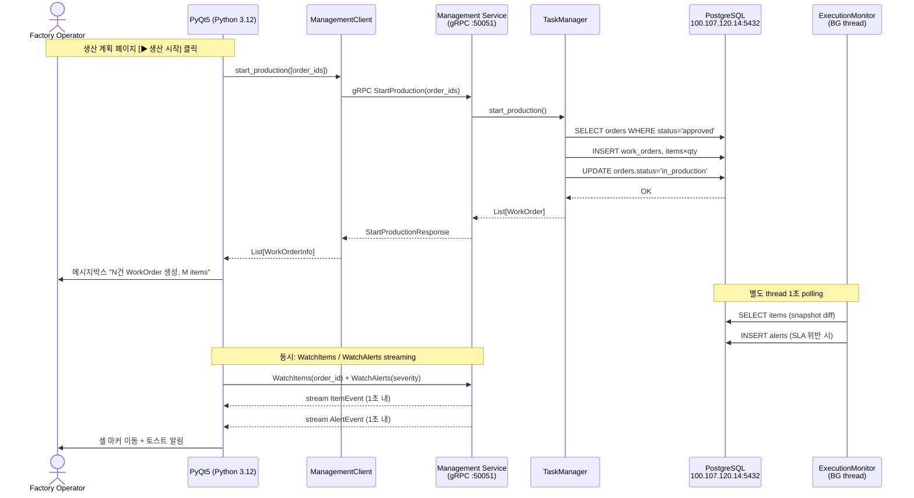
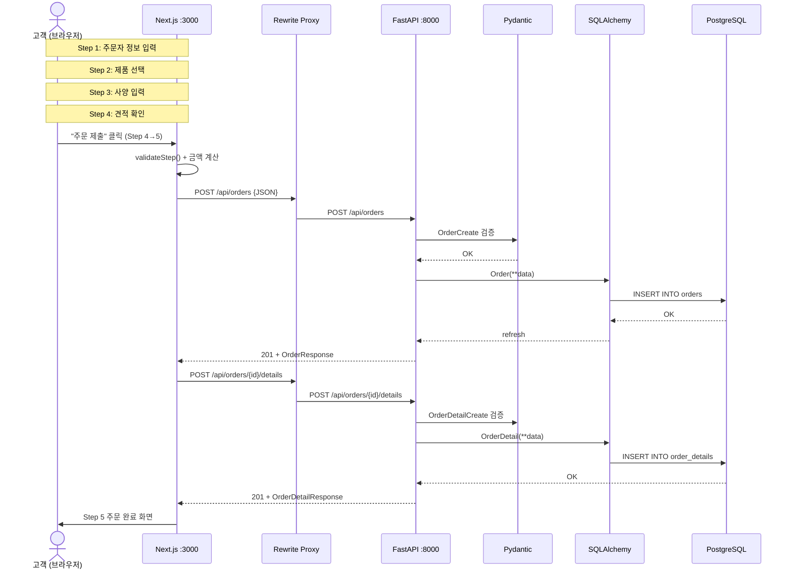
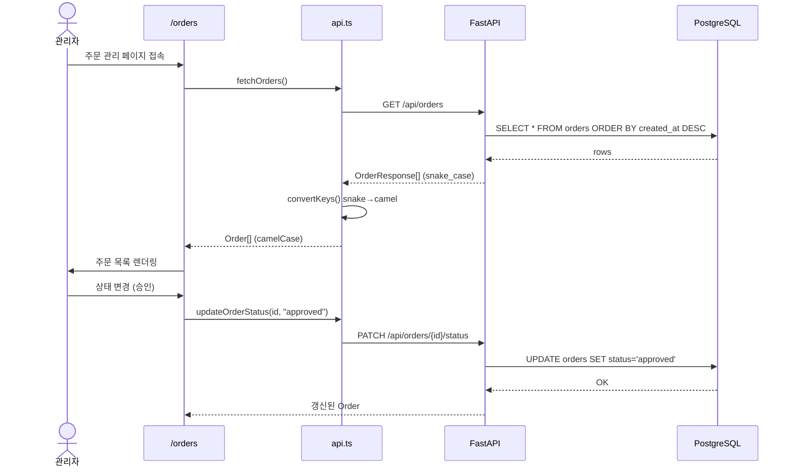
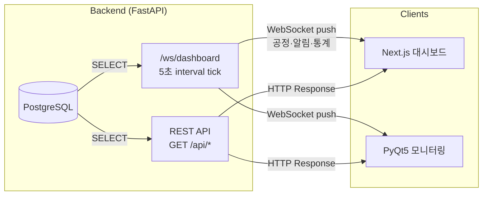
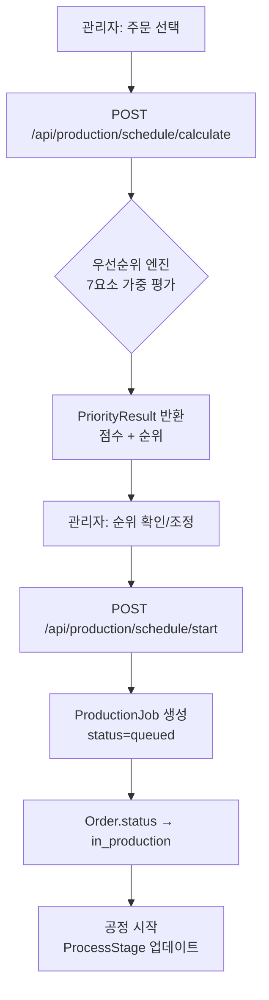
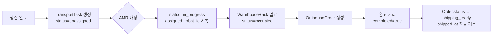
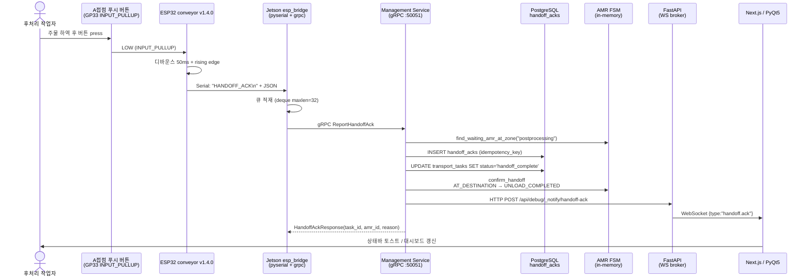

# 데이터 흐름

> **Last updated**: 2026-04-17 (SPEC-AMR-001 후처리존 핸드오프 ACK 흐름 추가)

## 0. V6 핵심 흐름: Factory PC PyQt → Management Service gRPC



## 0.1 V6 HW 통신 채널 (Adapter 라우팅)

```mermaid
flowchart LR
    EX[ExecuteCommand RPC] --> RT{robot_id prefix}
    RT -->|AMR-* / ARM-*| ROS[ros2_adapter<br>MGMT_ROS2_ENABLED=1<br>RPi 배포 시]
    RT -->|CONV-* / ESP-*| MQTT[mqtt_adapter<br>casting/esp/&#123;id&#125;/cmd]
    RT -->|UNKNOWN| ERR[unknown_robot_prefix<br>거부]

    ROS -->|nav2 Action| AMR[AMR/Cobot RPi]
    MQTT -->|paho-mqtt :1883| ESP[ESP32 펌웨어]

    IMG[Image Publisher<br>Jetson] -->|PublishFrames<br>gRPC client stream| SINK[image_sink<br>최신 1프레임 메모리]
```



## 1. 핵심 요청 흐름: 고객 온라인 발주



### 데이터 변환 체인

```
[React State (camelCase)]
    │ formData.contactPerson → customer_name
    │ formData.companyName → company_name
    │ formData.phone → contact
    ▼
[fetch() JSON Body (snake_case)]
    │ Next.js Rewrite: /api/* → localhost:8000/api/*
    ▼
[FastAPI Route Handler]
    │ Pydantic OrderCreate.model_dump()
    ▼
[SQLAlchemy Model]
    │ Order(**payload) → db.add() → db.commit()
    ▼
[PostgreSQL Row]
    orders.customer_name, orders.company_name, orders.contact
```

## 2. 관리자 주문 관리 흐름



## 3. 실시간 대시보드 흐름



> **참고**: 현재 WebSocket은 MQTT 브리지가 아니라, 서버 내부에서 5초마다
> DB를 조회하여 공정 진행·알림·대시보드 통계를 클라이언트로 push하는 구조.
> MQTT 브리지는 `asyncio-mqtt` 의존성이 등록되어 있으나 Phase 2 이후 구현 예정.

## 4. 생산 스케줄링 흐름



## 5. 품질 검사 흐름

```
검사 장비 → InspectionRecord INSERT
    │
    ├─ result=pass → SorterLog (정방향) → 포장 스테이션
    │
    └─ result=fail → SorterLog (역방향) → 재작업 라인
         │
         └─ defect_type, defect_detail 기록

통계 집계: GET /api/quality/stats
    → total, passed, failed, defect_rate, defect_types,
      defect_type_codes, inspector_stats
```

## 6. 물류/출고 흐름



## 6.1 후처리존 인수인계 ACK (SPEC-AMR-001, 2026-04-17)

AMR 이 postproc zone 에 도착한 후, 작업자가 주물을 하역하고 컨베이어 ESP32 의
A접점 푸시 버튼을 누르기 전까지 AMR 은 다음 TASK 로 진행하지 않는다. 버튼
이벤트는 다음 체인으로 전파되어 DB 에 영구 기록된다.



**시뮬레이션 경로 (HW 없이 테스트)**:
- **ESP32**: Serial Monitor 에서 `sim_ack` → 실제 버튼과 동일 이벤트
- **Backend**: `curl -X POST /api/debug/handoff-ack` → DB + WS 직접 트리거
- **Next.js DEV**: 우하단 "🔴 SIM Handoff ACK" 버튼 (`NODE_ENV=development` 전용)

## 7. 데이터 소유권 매트릭스

| 도메인 | 생성(Write) | 조회(Read) |
|--------|------------|-----------|
| 주문 (orders) | 고객 웹 (`/customer`) | 관리자 웹 (`/orders`), PyQt5 |
| 주문 상세 (order_details) | 고객 웹 (`/customer`) | 관리자 웹 (`/orders`) |
| 공정 (process_stages) | 시드 / PyQt5 공정 | 관리자 웹 (`/production`), PyQt5 |
| 설비 (equipment) | 시드 / IoT | 관리자 웹 (`/`), PyQt5 |
| 알림 (alerts) | 시드 / IoT / 백엔드 | 관리자 웹 (`/`), PyQt5 |
| 검사 (inspection_records) | 검사 장비 / 시드 | 관리자 웹 (`/quality`), PyQt5 |
| 이송 (transport_tasks) | 관리자 웹 / 시드 | 관리자 웹 (`/logistics`), PyQt5 |
| 창고 (warehouse_racks) | 시드 / 이송 완료 | 관리자 웹 (`/logistics`), PyQt5 |
| 출고 (outbound_orders) | 시드 / 관리자 | 관리자 웹 (`/logistics`) |
| 생산 작업 (production_jobs) | 스케줄러 | 관리자 웹 (`/orders`), PyQt5 |
| 생산 통계 (production_metrics) | 시드 / 집계 | 관리자 웹 (`/production`) |
| 핸드오프 ACK (handoff_acks) | ESP32 버튼 / Mgmt gRPC / debug REST | 관리자 웹 (/api/debug/handoff-acks/recent), PyQt5 (WS) |
