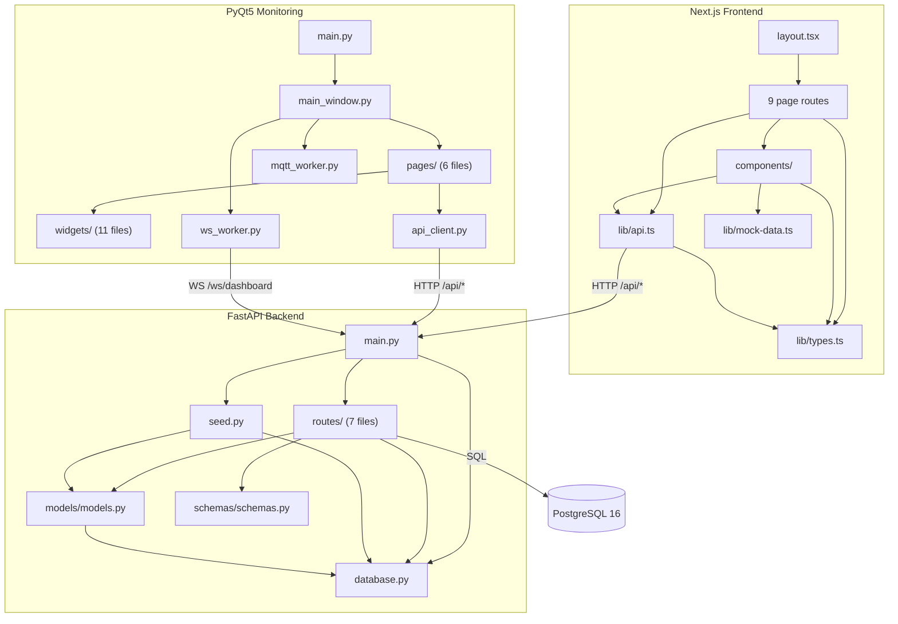

# 의존성 그래프

> **Last updated**: 2026-04-13

## 1. 외부 의존성

### 1.1 Frontend (package.json)

| 패키지 | 버전 | 용도 |
|--------|------|------|
| next | 16.2.1 | SSR/CSR 프레임워크 |
| react / react-dom | 19.2.4 | UI 라이브러리 |
| @react-three/fiber | 9.5 | React Three.js 렌더러 |
| @react-three/drei | 10.7 | Three.js 유틸리티 |
| three | 0.183 | 3D 그래픽 |
| recharts | 3.8 | 차트 라이브러리 |
| lucide-react | 1.7 | 아이콘 |
| date-fns | 4.1 | 날짜 유틸 |
| clsx | 2.1 | 조건부 클래스명 |

### 1.2 Backend (requirements.txt)

| 패키지 | 버전 | 용도 |
|--------|------|------|
| fastapi | 0.115.0 | REST API 프레임워크 |
| uvicorn[standard] | 0.30.0 | ASGI 서버 |
| sqlalchemy | 2.0.35 | ORM |
| pydantic | 2.9.0 | 데이터 검증 |
| psycopg[binary] | 3.2.3 | PostgreSQL 드라이버 |
| asyncpg | 0.29.0 | 비동기 PG 드라이버 |
| alembic | 1.13.3 | DB 마이그레이션 |
| asyncio-mqtt | 0.16.2 | MQTT 클라이언트 |
| redis | 5.1.1 | 캐시/pub-sub |
| websockets | 13.0 | WebSocket 서버 |

### 1.3 Monitoring (requirements.txt) — Python 3.12

| 패키지 | 버전 | 용도 |
|--------|------|------|
| PyQt5 | 5.15.11 | GUI 프레임워크 |
| PyQtChart | 5.15.7 | 차트 위젯 |
| requests | 2.32.3 | HTTP 클라이언트 |
| websocket-client | 1.8.0 | WebSocket (V6: 비활성 기본) |
| paho-mqtt | 2.1.0 | MQTT 클라이언트 (옵션) |
| **grpcio** | **1.80** | **★ V6: Management Service 통신** |
| **grpcio-tools** | **1.80** | **★ V6: protoc + gen_proto.sh** |
| **protobuf** | **6.33** | **★ V6: 메시지 직렬화** |

### 1.4 Management Service (backend/management/requirements.txt) — Python 3.12

별도 venv (`backend/management/venv/`).

| 패키지 | 버전 | 용도 |
|--------|------|------|
| grpcio | ≥1.80 | gRPC 서버 |
| grpcio-tools | ≥1.80 | proto 컴파일 |
| protobuf | ≥6.30 | 메시지 직렬화 |
| sqlalchemy | ≥2.0.35 | ORM (Interface 와 동일 PG 공유) |
| psycopg[binary] | ≥3.2 | PostgreSQL 드라이버 |
| paho-mqtt | ≥2.1 | ESP32 MQTT publisher |

ROS2 (`rclpy`)는 시스템 패키지 (`apt install ros-jazzy-rclpy`), pip 미지원.

## 2. 내부 모듈 의존성 그래프



## 3. 계층별 의존성 방향

```
Presentation (src/, monitoring/)
      │
      ▼  HTTP / WebSocket / MQTT
Business Logic (backend/app/routes/)
      │
      ▼  SQLAlchemy ORM
Data (backend/app/models/ → PostgreSQL)
```

**규칙**: 의존성은 항상 위에서 아래로만 흐른다. 역방향 의존성은 없음.

## 4. 순환 의존성

현재 순환 의존성 **없음**.

- `models.py` → `database.py` (단방향)
- `routes/*` → `models.py` + `schemas.py` + `database.py` (단방향)
- `main.py` → `routes/*` + `database.py` + `seed.py` (단방향)

## 5. 고연결 모듈 (High Fan-In)

| 모듈 | Fan-In | 설명 |
|------|--------|------|
| `database.py` | 9 | main, seed, 7 route 파일 모두 의존 |
| `models/models.py` | 8 | seed + 7 route 파일 의존 |
| `schemas/schemas.py` | 7 | 7 route 파일 의존 |
| `lib/types.ts` | ~15 | 거의 모든 프론트엔드 파일 의존 |
| `lib/api.ts` | ~10 | 모든 관리자 페이지 + 고객 조회 의존 |
